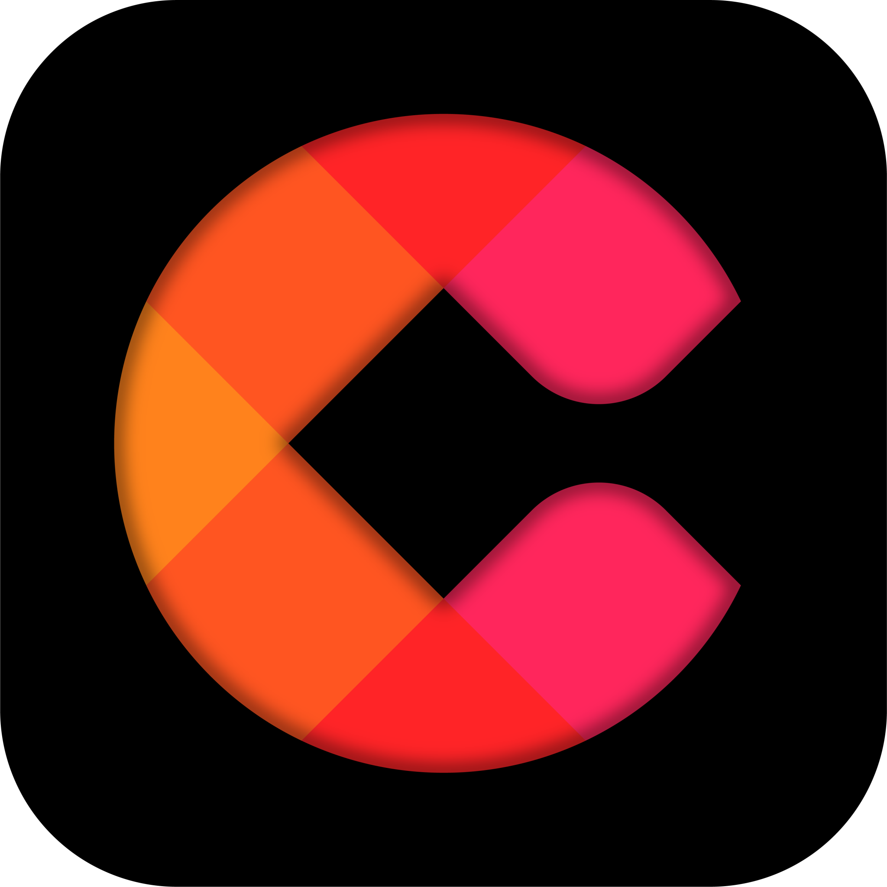
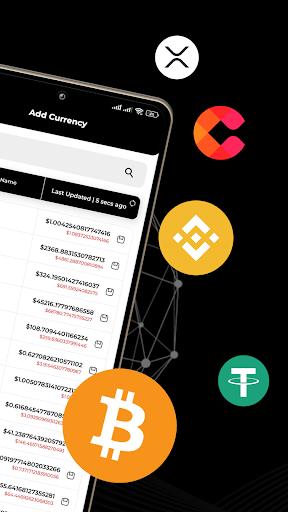
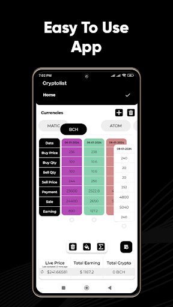
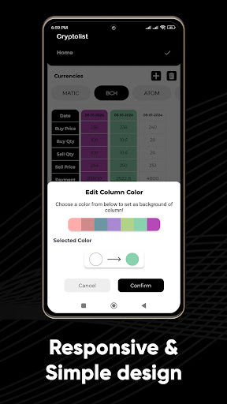
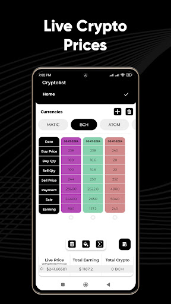
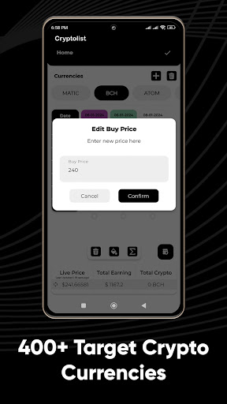
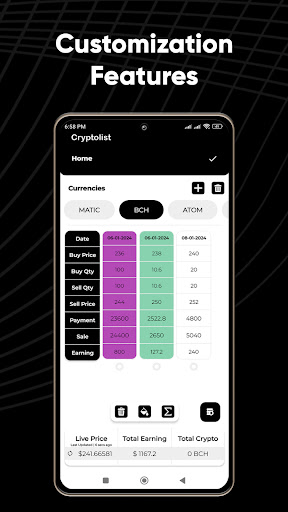
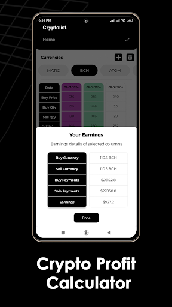

  

# CryptoList

## Fast access to all your crypto trades. Profit Tracker. Crypto Profit Calculator.

Unlock the power of precision trading with our Crypto App – your ultimate companion in the fast-paced world of cryptocurrency. Experience lightning-fast access to all your trades, armed with a robust Trade Tracker and Crypto Profit Calculator.

## 🚀 Key Features:

- **Fast access to all your crypto trades**
- **Easy-to-use interface**
- **Responsive and sleek design**
- **Live crypto prices at your fingertips**
- **Track 400+ target cryptocurrencies**
- **Crypto profit calculator for instant insights**
- **User customization for a personalized experience**

## 📈 Why Choose Our Crypto App?

The cryptocurrency market is a rollercoaster, with prices changing rapidly. In just 15 minutes, values can surge by 5%. As a savvy crypto day trader, you need the right tools for the job. Our app provides quick access to your trades, allowing you to make informed decisions on when to take profits or cut losses.

## ⏱ Instant Trade Insights:

Within seconds, gain a comprehensive overview of your trades – from purchase details to quantities and prices. Our app is designed for traders who value efficiency and want to stay ahead in the crypto game.

## 💡 Crafted by a Fellow Trader:

Built by a dedicated crypto day trader who turned losses into gains, this app is a testament to overcoming challenges in the market. We understand the importance of making informed decisions, and our app is here to empower you on your trading journey.

## 🌐 Join the Crypto Community:

Now, we're thrilled to share our success with you and contribute to the thriving crypto community. Download our Crypto App today, take control of your trades, and elevate your trading experience to new heights. Start making profitable decisions with confidence!

## Featured Image:

  

## Screenshots:

  
  
  
  

  
  
  
  

---

© 2024 CryptoLoist. All rights reserved.
